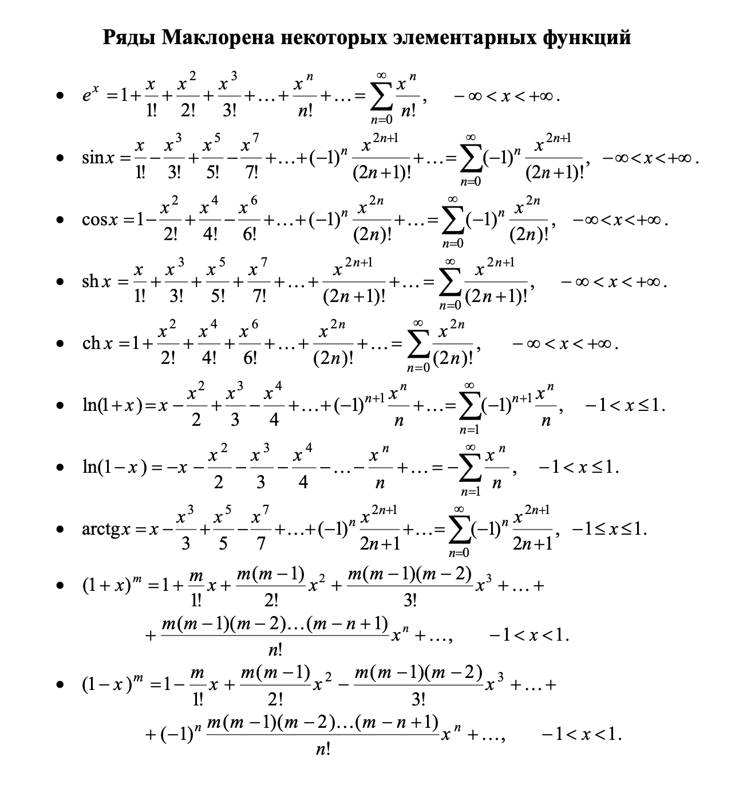

# Вычисление функций с использованием рядов Маклорена

Этот проект предоставляет реализацию вычисления различных математических функций (e^x, sh(x), (1-x)^m, sin(x), cos(x)) с использованием их разложения в ряд Маклорена. Программа включает в себя интерактивное меню, позволяющее пользователю выбрать желаемую функцию и ввести необходимые параметры.

## Функциональность

- Вычисление e^x, sh(x), (1-x)^m, sin(x), cos(x), ch(x) с заданной точностью.
- Интерактивное меню для выбора функции.
- Проверка ввода на корректность (числовые значения и их диапазоны).

## Как использовать

1.  Клонируйте репозиторий с кодом.
2.  Убедитесь, что у вас установлен Python 3.
3.  Запустите скрипт `main.py`:

    ```bash
    python main.py
    ```

4.  Следуйте инструкциям меню в консоли.

## Меню
1. Вычисление e^x
2. Вычисление sh(x)
3. Вычисление (1-x)^m
4. Вычисление sin(x)
5. Вычисление cos(x)
6. Вычисление ch(x)
0. Выход

## Описание функций

### `func1(n, x)`

- **Короткое описание:** Вычисляет значение e^x с помощью ряда Маклорена.
- **Подробное описание:**  Функция аппроксимирует значение экспоненты e^x используя ряд Маклорена. Вычисление ведется до n-ого члена ряда.
    Формула ряда:

$$ e^x = \sum_{k=0}^{\infty} \frac{x^k}{k!} = 1 + x + \frac{x^2}{2!} + \frac{x^3}{3!} + ... $$


- **Аргументы:**
  - `n` (*int*): Количество итераций (точность вычисления) ряда.
  - `x` (*int*): Значение аргумента экспоненты.
- **Возвращаемое значение:**
    - (*float*): Приближенное значение e^x.
- **Исключения:**
    - *Отсутствуют*.
- **Примеры использования:**
  
   ```python
   result = func1(10, 2)
   print(result) # Выведет: 7.388712522024467
   ```

### `func4(n, x)`

- **Короткое описание:** Вычисляет значение sh(x) (гиперболического синуса) с помощью ряда Маклорена.
- **Подробное описание:** Функция аппроксимирует значение гиперболического синуса sh(x) используя ряд Маклорена. Вычисление ведется до n-ого члена ряда.
    Формула ряда:

$$ sh(x) = \sum_{k=0}^{\infty} \frac{x^{2k+1}}{(2k+1)!} = x + \frac{x^3}{3!} + \frac{x^5}{5!} + ... $$

- **Аргументы:**
  - `n` (*int*): Количество итераций (точность вычисления) ряда.
  - `x` (*int*): Значение аргумента гиперболического синуса.
- **Возвращаемое значение:**
    - (*float*): Приближенное значение sh(x).
- **Исключения:**
    - *Отсутствуют*.
- **Примеры использования:**
  
   ```python
   result = func4(10, 1)
   print(result) # Выведет: 1.1752011936438014
   ```
### `func10(n, x, m)`

- **Короткое описание:** Вычисляет значение (1-x)^m с помощью ряда Маклорена.
- **Подробное описание:** Функция аппроксимирует значение (1-x)^m используя ряд Маклорена. Вычисление ведется до n-ого члена ряда.
    Формула ряда:

$$ (1-x)^m = \sum_{k=0}^{\infty} \frac{m(m-1)(m-2)...(m-k+1)}{k!}(-x)^k = 1 - mx + \frac{m(m-1)}{2!}x^2 - ... $$

- **Аргументы:**
  - `n` (*int*): Количество итераций (точность вычисления) ряда.
  - `x` (*float*): Значение аргумента. Должно лежать в пределах -1 до 1.
  - `m` (*int*): Значение степени. Должно лежать в пределах -100 до 100.
- **Возвращаемое значение:**
    - (*float*): Приближенное значение (1-x)^m.
- **Исключения:**
    - *Отсутствуют*.
- **Примеры использования:**
  
   ```python
   result = func10(10, 0.5, 2)
   print(result) # Выведет: 0.25
   ```
  
### `func2(n, x)`
- **Короткое описание:** Вычисляет значение sin(x) с помощью ряда Маклорена.
- **Подробное описание:** Функция аппроксимирует значение синуса sin(x) используя ряд Маклорена. Вычисление ведется до n-ого члена ряда.
    Формула ряда:

$$ sin(x) = \sum_{k=0}^{\infty} \frac{(-1)^k x^{2k+1}}{(2k+1)!} = x - \frac{x^3}{3!} + \frac{x^5}{5!} - ... $$

- **Аргументы:**
  - `n` (*int*): Количество итераций (точность вычисления) ряда.
  - `x` (*int*): Значение аргумента синуса.
- **Возвращаемое значение:**
    - (*float*): Приближенное значение sin(x).
- **Исключения:**
    - *Отсутствуют*.
- **Примеры использования:**
  
   ```python
   result = func2(10, 1)
   print(result) # Выведет: 0.8414709848078965
   ```
   
### `func3(n, x)`
- **Короткое описание:** Вычисляет значение cos(x) с помощью ряда Маклорена.
- **Подробное описание:** Функция аппроксимирует значение косинуса cos(x) используя ряд Маклорена. Вычисление ведется до n-ого члена ряда.
    Формула ряда:

$$ cos(x) = \sum_{k=0}^{\infty} \frac{(-1)^k x^{2k}}{(2k)!} = 1 - \frac{x^2}{2!} + \frac{x^4}{4!} - ... $$

- **Аргументы:**
  - `n` (*int*): Количество итераций (точность вычисления) ряда.
  - `x` (*int*): Значение аргумента косинуса.
- **Возвращаемое значение:**
    - (*float*): Приближенное значение cos(x).
- **Исключения:**
    - *Отсутствуют*.
- **Примеры использования:**
  
   ```python
   result = func3(10, 1)
   print(result) # Выведет: 0.5403023058681398
   ```

### `func5(n, x)`

- **Короткое описание:** Вычисляет значение ch(x) (гиперболического косинуса) с помощью ряда Маклорена.
- **Подробное описание:** Функция аппроксимирует значение гиперболического косинуса ch(x) используя ряд Маклорена. Вычисление ведется до n-ого члена ряда.
    Формула ряда:
    
$$ ch(x) = \sum_{k=0}^{\infty} \frac{x^{2k}}{(2k)!} = 1 + \frac{x^2}{2!} + \frac{x^4}{4!} + ... $$
    
- **Аргументы:**
  - `n` (*int*): Количество итераций (точность вычисления) ряда.
  - `x` (*int*): Значение аргумента гиперболического косинуса.
- **Возвращаемое значение:**
    - (*float*): Приближенное значение ch(x).
- **Исключения:**
    - *Отсутствуют*.
- **Примеры использования:**

   ```python
   result = func5(10, 1)
   print(result) # Выведет: 1.5430806348152437
   ```
### `func10_sup(m, c)`

- **Короткое описание:** Вспомогательная функция для вычисления коэффициентов в разложении (1-x)^m.
- **Подробное описание:** Функция вычисляет произведение `m(m-1)(m-2)...(m-c+1)`, необходимое для вычисления коэффициентов в ряде Маклорена для функции (1-x)^m.
- **Аргументы:**
    - `m` (*int*): Значение степени.
    - `c` (*int*): Номер члена ряда.
- **Возвращаемое значение:**
    - (*int*): Произведение `m(m-1)(m-2)...(m-c+1)`.
- **Исключения:**
    - *Отсутствуют*.
- **Примеры использования:**
  
    ```python
   result = func10_sup(5, 3)
   print(result) # Выведет: 60
    ```

## Чек-лист

- [x] Реализованы все необходимые функции.
- [x] Добавлено интерактивное меню.
- [x] Обработка ввода чисел реализована с проверкой на корректность.
- [x] Проект сопровождается подробным файлом README.md.

## Дополнительные ссылки
*   [Ряд Маклорена на Википедии](https://ru.wikipedia.org/wiki/%D0%A0%D1%8F%D0%B4_%D0%9C%D0%B0%D0%BA%D0%BB%D0%BE%D1%80%D0%B5%D0%BD%D0%B0)

## Изображение


